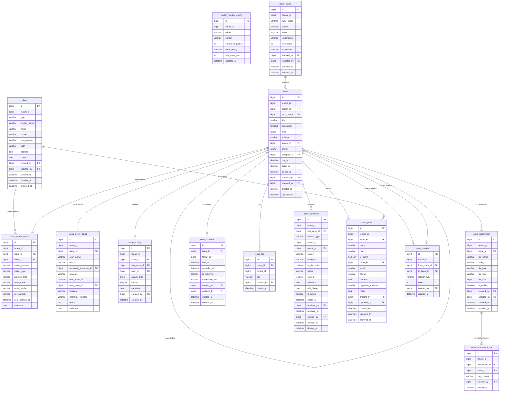

## Case Management Domain v3

```mermaid
erDiagram

  client {
    bigint id PK
    bigint tenant_id
    varchar type
    varchar display_name
    varchar email
    varchar phone
    varchar pan_number
    varchar gstin
    text address
    text notes
    bigint created_by FK
    bigint updated_by FK
    datetime created_at
    datetime updated_at
    datetime archived_at
  }

  matter_number_config {
    bigint id PK
    bigint tenant_id
    varchar prefix
    varchar pattern
    int current_sequence
    boolean reset_yearly
    int last_reset_year
    datetime updated_at
  }

  issue_status {
    bigint id PK
    bigint tenant_id
    varchar type_scope
    varchar name
    varchar color
    varchar description
    int sort_order
    boolean is_default
    bigint created_by FK
    bigint updated_by FK
    datetime created_at
    datetime updated_at
  }

  issue {
    bigint id PK
    bigint tenant_id
    bigint parent_id FK
    bigint root_case_id FK
    varchar title
    longtext description
    enum type
    varchar subtype
    bigint status_id FK
    enum priority
    bigint assignee_id FK
    datetime due_at
    datetime event_at
    datetime closed_at
    bigint created_by FK
    bigint updated_by FK
    datetime created_at
    datetime updated_at
  }

  issue_matter_detail {
    bigint id PK
    bigint tenant_id
    bigint issue_id FK
    bigint client_id FK
    varchar matter_number
    varchar matter_type
    varchar practice_area
    varchar court_name
    varchar case_number
    varchar cnr_number
    datetime next_hearing_at
    json metadata
  }

  issue_event_detail {
    bigint id PK
    bigint tenant_id
    bigint issue_id FK
    varchar court_name
    varchar bench
    bigint appearing_advocate_id FK
    varchar outcome
    datetime next_event_at
    bigint next_issue_id FK
    varchar location
    varchar reference_number
    text notes
    json metadata
  }

  issue_activity {
    bigint id PK
    bigint tenant_id
    bigint issue_id FK
    bigint root_case_id FK
    bigint user_id FK
    enum activity_type
    longtext content
    json metadata
    bigint created_by FK
    datetime created_at
  }

  issue_attachment {
    bigint id PK
    bigint tenant_id
    bigint issue_id FK
    varchar file_name
    varchar blob_uri
    varchar file_hash
    varchar file_type
    bigint file_size
    boolean is_verified
    bigint created_by FK
    bigint updated_by FK
    datetime created_at
    datetime updated_at
  }

  issue_attachment_link {
    bigint id PK
    bigint tenant_id
    bigint attachment_id FK
    bigint issue_id FK
    varchar link_context
    bigint created_by FK
    datetime created_at
  }

  issue_schedule {
    bigint id PK
    bigint issue_id FK
    bigint tenant_id
    datetime due_at
    datetime reminder_at
    boolean is_recurring
    varchar recurrence_rule
    bigint created_by FK
    bigint updated_by FK
    datetime created_at
    datetime updated_at
  }

  issue_tag {
    bigint id PK
    bigint issue_id FK
    bigint tenant_id
    varchar tag
    bigint created_by FK
    datetime created_at
  }

  issue_comment {
    bigint id PK
    bigint tenant_id
    bigint root_case_id FK
    varchar context_type
    bigint context_id
    bigint parent_id FK
    varchar subject
    varchar category
    boolean is_discussion
    varchar status
    longtext content
    json mentions
    json edit_history
    boolean is_edited
    datetime edited_at
    bigint resolved_by FK
    datetime resolved_at
    bigint created_by FK
    datetime created_at
    datetime deleted_at
  }

  issue_party {
    bigint id PK
    bigint tenant_id
    bigint issue_id FK
    varchar name
    varchar role
    boolean is_client
    bigint client_id FK
    varchar email
    varchar phone
    text address
    varchar opposing_advocate
    text notes
    bigint created_by FK
    bigint updated_by FK
    datetime created_at
    datetime updated_at
    datetime archived_at
  }

  issue_relation {
    bigint id PK
    bigint tenant_id
    bigint from_issue_id FK
    bigint to_issue_id FK
    varchar relation_type
    text notes
    bigint created_by FK
    datetime created_at
  }

  

  client ||--o{ issue_matter_detail : "client matters"

  issue_status ||--o{ issue : "statuses"

  issue ||--o{ issue : "parent-child"

  issue ||--|| issue_matter_detail : "matter details"

  issue ||--|| issue_event_detail : "event details"

  issue ||--o{ issue_activity : "timeline"

  issue ||--o{ issue_attachment : "attachments"

  issue_attachment ||--o{ issue_attachment_link : "linked attachments"

  issue ||--o{ issue_schedule : "schedules"

  issue ||--o{ issue_tag : "tags"

  issue ||--o{ issue_comment : "comments"

  issue ||--o{ issue_party : "parties"

  client ||--o{ issue_party : "client party"

  issue ||--o{ issue_relation : "source relation"
  issue ||--o{ issue_relation : "target relation"

  
    
```
