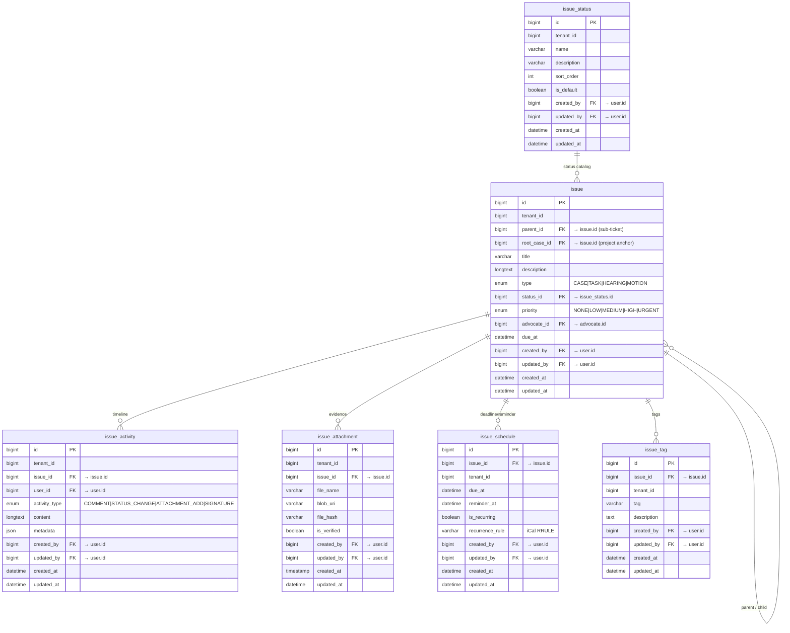

## Case Management Domain

```mermaid
erDiagram
    issue_status {
        bigint id PK
        bigint tenant_id
        varchar name
        varchar description
        int sort_order
        boolean is_default
        bigint created_by FK "→ user.id"
        bigint updated_by FK "→ user.id"
        datetime created_at
        datetime updated_at
    }

    issue {
        bigint id PK
        bigint tenant_id
        bigint parent_id FK "→ issue.id (sub-ticket)"
        bigint root_case_id FK "→ issue.id (project anchor)"
        varchar title
        longtext description
        enum type "CASE|TASK|HEARING|MOTION"
        bigint status_id FK "→ issue_status.id"
        enum priority "NONE|LOW|MEDIUM|HIGH|URGENT"
        bigint advocate_id FK "→ advocate.id"
        datetime due_at
        bigint created_by FK "→ user.id"
        bigint updated_by FK "→ user.id"
        datetime created_at
        datetime updated_at
    }

    issue_activity {
        bigint id PK
        bigint tenant_id
        bigint issue_id FK "→ issue.id"
        bigint user_id FK "→ user.id"
        enum activity_type "COMMENT|STATUS_CHANGE|ATTACHMENT_ADD|SIGNATURE"
        longtext content
        json metadata
        bigint created_by FK "→ user.id"
        bigint updated_by FK "→ user.id"
        datetime created_at
        datetime updated_at
    }

    issue_attachment {
        bigint id PK
        bigint tenant_id
        bigint issue_id FK "→ issue.id"
        varchar file_name
        varchar blob_uri
        varchar file_hash
        boolean is_verified
        bigint created_by FK "→ user.id"
        bigint updated_by FK "→ user.id"
        timestamp created_at
        datetime updated_at
    }

    issue_schedule {
        bigint id PK
        bigint issue_id FK "→ issue.id"
        bigint tenant_id
        datetime due_at
        datetime reminder_at
        boolean is_recurring
        varchar recurrence_rule "iCal RRULE"
        bigint created_by FK "→ user.id"
        bigint updated_by FK "→ user.id"
        datetime created_at
        datetime updated_at
    }

    issue_tag {
        bigint id PK
        bigint issue_id FK "→ issue.id"
        bigint tenant_id
        varchar tag
        text description
        bigint created_by FK "→ user.id"
        bigint updated_by FK "→ user.id"
        datetime created_at
        datetime updated_at
    }

    issue_status ||--o{ issue : "status catalog"
    issue ||--o{ issue : "parent / child"
    issue ||--o{ issue_activity : "timeline"
    issue ||--o{ issue_attachment : "evidence"
    issue ||--o{ issue_schedule : "deadline/reminder"
    issue ||--o{ issue_tag : "tags"
```
