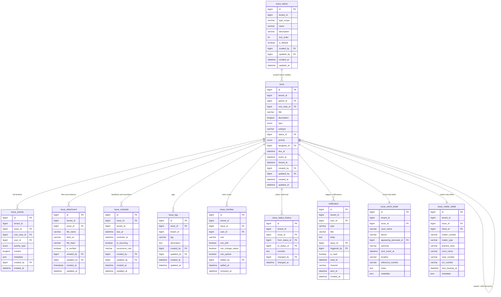

 ## Case Management Domain v2

```mermaid
erDiagram

    issue_status {
        bigint id PK
        bigint tenant_id
        varchar type_scope
        varchar name
        varchar description
        int sort_order
        boolean is_default
        bigint created_by FK
        bigint updated_by FK
        datetime created_at
        datetime updated_at
    }

    issue {
        bigint id PK
        bigint tenant_id
        bigint parent_id FK
        bigint root_case_id FK
        varchar title
        longtext description
        enum type
        varchar subtype
        bigint status_id FK
        enum priority
        bigint assignee_id FK
        datetime due_at
        datetime event_at
        datetime closed_at
        bigint created_by FK
        bigint updated_by FK
        datetime created_at
        datetime updated_at
    }

    issue_activity {
        bigint id PK
        bigint tenant_id
        bigint issue_id FK
        bigint root_case_id FK
        bigint user_id FK
        enum activity_type
        longtext content
        json metadata
        bigint created_by FK
        datetime created_at
    }

    issue_attachment {
        bigint id PK
        bigint tenant_id
        bigint issue_id FK
        varchar file_name
        varchar blob_uri
        varchar file_hash
        boolean is_verified
        bigint created_by FK
        bigint updated_by FK
        timestamp created_at
        datetime updated_at
    }

    issue_schedule {
        bigint id PK
        bigint issue_id FK
        bigint tenant_id
        datetime due_at
        datetime reminder_at
        boolean is_recurring
        varchar recurrence_rule
        bigint created_by FK
        bigint updated_by FK
        datetime created_at
        datetime updated_at
    }

    issue_tag {
        bigint id PK
        bigint issue_id FK
        bigint tenant_id
        varchar tag
        text description
        bigint created_by FK
        bigint updated_by FK
        datetime created_at
        datetime updated_at
    }

    issue_member {
        bigint id PK
        bigint tenant_id
        bigint issue_id FK
        bigint user_id FK
        varchar role
        boolean can_edit
        boolean can_change_status
        boolean can_upload
        bigint added_by FK
        datetime added_at
        datetime removed_at
    }

    issue_status_history {
        bigint id PK
        bigint tenant_id
        bigint issue_id FK
        bigint from_status_id FK
        bigint to_status_id FK
        text remarks
        bigint changed_by FK
        datetime changed_at
    }

    notification {
        bigint id PK
        bigint tenant_id
        bigint user_id FK
        varchar type
        varchar title
        text body
        bigint issue_id FK
        bigint triggered_by FK
        boolean is_read
        datetime read_at
        varchar channel
        datetime sent_at
        datetime created_at
    }

    issue_event_detail {
        bigint id PK
        bigint tenant_id
        bigint issue_id FK
        varchar court_name
        varchar bench
        bigint appearing_advocate_id FK
        varchar outcome
        datetime next_event_at
        varchar location
        varchar reference_number
        text notes
        json metadata
    }

    issue_matter_detail {
        bigint id PK
        bigint tenant_id
        bigint issue_id FK
        bigint client_id FK
        varchar matter_number
        varchar matter_type
        varchar practice_area
        varchar court_name
        varchar case_number
        varchar cnr_number
        datetime next_hearing_at
        json metadata
    }

    issue_status ||--o{ issue : "scoped status catalog"

    issue ||--o{ issue : "parent / child hierarchy"

    issue ||--o{ issue_activity : "full timeline"
    issue ||--o{ issue_attachment : "files and evidence"
    issue ||--o{ issue_schedule : "deadlines and reminders"
    issue ||--o{ issue_tag : "tags"
    issue ||--o{ issue_member : "team roster"
    issue ||--o{ issue_status_history : "status audit trail"
    issue ||--o{ notification : "triggers notifications"

    issue ||--|| issue_event_detail : "event-only fields"
    issue ||--|| issue_matter_detail : "matter-only fields"
```
