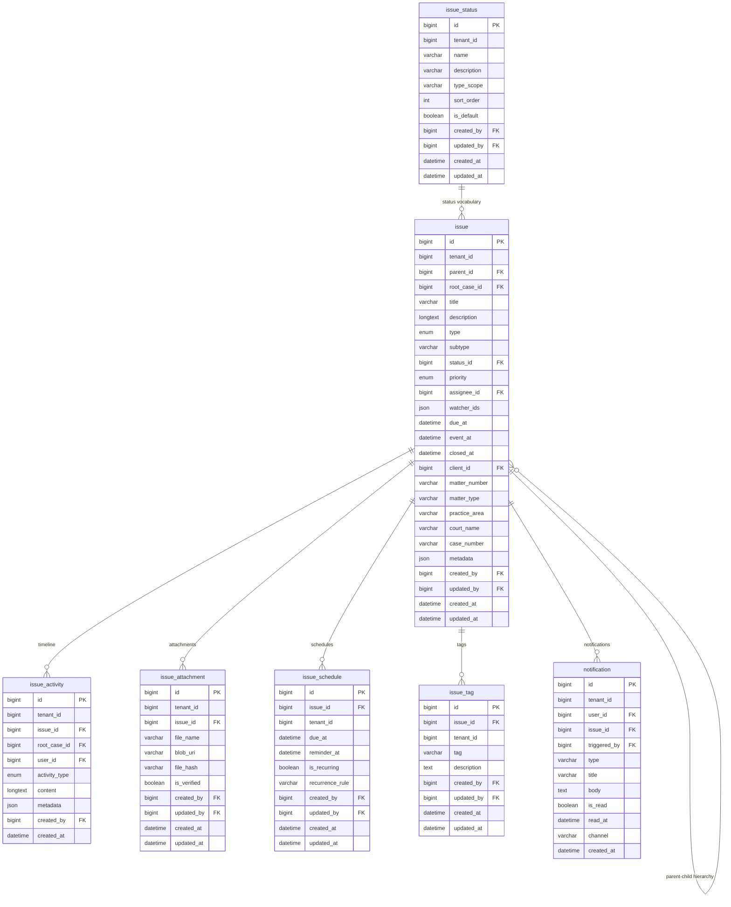

## Case Management Domain v3

```mermaid
erDiagram

    issue_status {
        bigint id PK
        bigint tenant_id
        varchar name
        varchar description
        varchar type_scope
        int sort_order
        boolean is_default
        bigint created_by FK
        bigint updated_by FK
        datetime created_at
        datetime updated_at
    }

    issue {
        bigint id PK
        bigint tenant_id
        bigint parent_id FK
        bigint root_case_id FK
        varchar title
        longtext description
        enum type
        varchar subtype
        bigint status_id FK
        enum priority
        bigint assignee_id FK
        json watcher_ids
        datetime due_at
        datetime event_at
        datetime closed_at
        bigint client_id FK
        varchar matter_number
        varchar matter_type
        varchar practice_area
        varchar court_name
        varchar case_number
        json metadata
        bigint created_by FK
        bigint updated_by FK
        datetime created_at
        datetime updated_at
    }

    issue_activity {
        bigint id PK
        bigint tenant_id
        bigint issue_id FK
        bigint root_case_id FK
        bigint user_id FK
        enum activity_type
        longtext content
        json metadata
        bigint created_by FK
        datetime created_at
    }

    issue_attachment {
        bigint id PK
        bigint tenant_id
        bigint issue_id FK
        varchar file_name
        varchar blob_uri
        varchar file_hash
        boolean is_verified
        bigint created_by FK
        bigint updated_by FK
        datetime created_at
        datetime updated_at
    }

    issue_schedule {
        bigint id PK
        bigint issue_id FK
        bigint tenant_id
        datetime due_at
        datetime reminder_at
        boolean is_recurring
        varchar recurrence_rule
        bigint created_by FK
        bigint updated_by FK
        datetime created_at
        datetime updated_at
    }

    issue_tag {
        bigint id PK
        bigint issue_id FK
        bigint tenant_id
        varchar tag
        text description
        bigint created_by FK
        bigint updated_by FK
        datetime created_at
        datetime updated_at
    }

    notification {
        bigint id PK
        bigint tenant_id
        bigint user_id FK
        bigint issue_id FK
        bigint triggered_by FK
        varchar type
        varchar title
        text body
        boolean is_read
        datetime read_at
        varchar channel
        datetime created_at
    }

    issue_status ||--o{ issue : "status vocabulary"

    issue ||--o{ issue : "parent-child hierarchy"

    issue ||--o{ issue_activity : "timeline"
    issue ||--o{ issue_attachment : "attachments"
    issue ||--o{ issue_schedule : "schedules"
    issue ||--o{ issue_tag : "tags"
    issue ||--o{ notification : "notifications"
```
